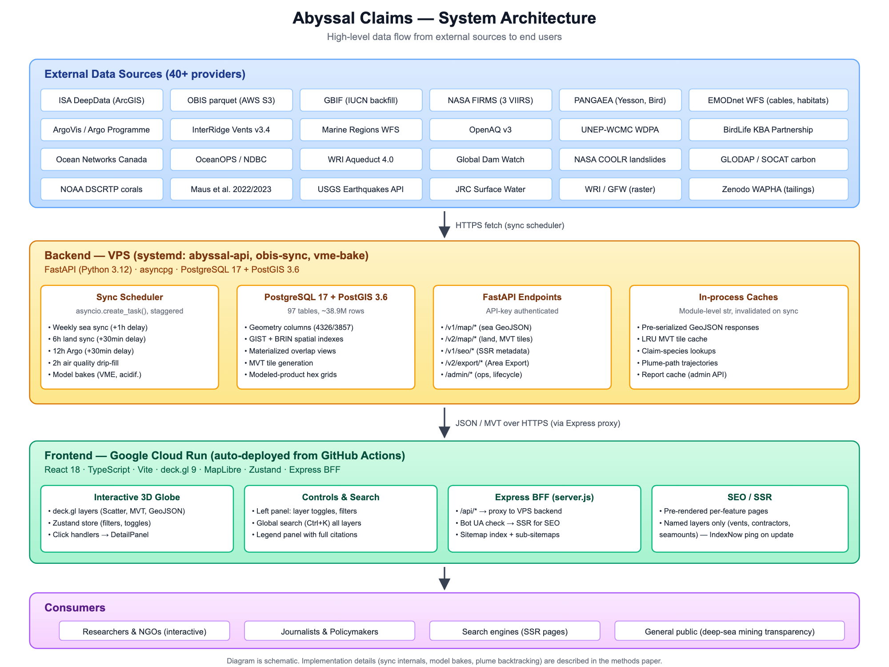

# Abyssal Claims

**A FAIR-aligned integration platform for deep-sea and terrestrial mining transparency.**

Abyssal Claims puts 50+ publicly funded, open-licensed geospatial datasets — ISA
concessions, deep-sea biodiversity, ocean biogeochemistry, submarine infrastructure,
Arctic land→ocean processes and terrestrial mining impacts — onto a single interactive
3D globe, so the environmental and governance context of seabed and land mineral
extraction is legible to researchers, journalists, policy analysts and the public.

Live: **https://something-rare.com** · Methods & data documentation (Zenodo, CC-BY-4.0):
**https://doi.org/10.5281/zenodo.19745884**



> This is a **scientific-infrastructure application, not a reusable framework.** The code
> is deliberately woven into the marine/mining domain — datasets, ingest quirks, editorial
> guardrails and per-source fixes are part of the point, not incidental. There is no
> extractable "aggregation engine" package, and none is planned.

## This repository: `something-rare-engine`

This is the **engine** — the platform's core, published as a **generated mirror** of a
private development repository. It is not the working tree, and it is not edited here.
Each release is produced by an allowlist export: a file reaches this repository only by
being named on that list, so nothing arrives by being forgotten.

**What the mirror deliberately does not carry**, and why:

| Absent | Why |
|---|---|
| `admin-panel/`, `org-portal/` | operator interfaces — separate applications, useless without the operator's credentials and infrastructure, and a needless attack surface to publish |
| `ops/`, `deploy/` | systemd units and deploy scripts that describe one specific live server |
| working notes, audits, design docs | internal engineering diaries; they document decisions, not the software. **Per-layer methods notes are the exception and do ship** — see `docs/methods/` |
| the development history | the commit history stays in the private repository; see *Contributing* below for what that means in practice |

Concrete infrastructure values in `.github/workflows/deploy-gcp*.yml` are replaced with
placeholders during export. Those workflows are included as a **pattern**, not as
something you can run unchanged.

## What this is (and is not)

- **Is:** the source code behind the live platform — a React + deck.gl frontend, a FastAPI
  + PostGIS backend, ~110 data-source sync pipelines, and the editorial/provenance logic
  that keeps the presentation neutral.
- **Is not:** a dataset. Every layer is fetched at run time from its upstream provider under
  that provider's own licence (see [`DATA-LICENCES.md`](DATA-LICENCES.md)). The exception is
  ~1.1 MB of test fixtures under `backend/tests/fixtures/`, which are **real** upstream
  excerpts, not synthetic — they carry their sources' terms too.
- **Is not:** a product or a portfolio pitch. It is published as citable open-science
  infrastructure.

## Architecture

```
Frontend  React 18 + TypeScript + Vite + deck.gl 9 + MapLibre + Zustand
          → Google Cloud Run; Express BFF proxies /api/* and serves SSR for bots (SEO)

Backend   FastAPI (Python 3.12) + asyncpg + PostgreSQL 17 / PostGIS 3.6
          → ~110 sync sources, MVT tile server with disk+LRU cache, baked raster fields,
            Area Export, a public read API, and a DB-backed API-key subsystem
```

## Running locally

Requires Node 20+, Python 3.12+, and a PostgreSQL 16+ with PostGIS 3.4+ database. The layers
populate themselves from upstream sources on first sync — expect a large database once
populated (the production instance is ~19 GB; you do not need every layer to run locally).

Comments and docstrings in the backend describe a **reference deployment** — a single VPS
running systemd units (`abyssal-api`, `obis-sync.service`, `vme-bake.service`) behind
`apiv2.something-rare.com`. They are there because they explain *why* a background task
waits fifteen minutes before its first run, or why a sync writes where it does. None of it
is required: your deployment does not have to reproduce that shape, and nothing in the code
checks for it.

### 1. Database

The schema code expects a role named `abyssal_user` to already exist (several
`ensure_*` steps run `ALTER TABLE ... OWNER TO abyssal_user`), so an empty PostGIS
database is not enough on its own. `backend/scripts/ci_bootstrap_db.py` is the same
bootstrap CI runs against a throwaway container — it creates the role, enables the
`postgis` extension, and runs every schema step in the required order:

```bash
createdb abyssal_dev
DATABASE_URL="postgresql://<user>@localhost/abyssal_dev" \
  python3 backend/scripts/ci_bootstrap_db.py
```

The connecting `<user>` needs `CREATE ROLE` and enough privilege to reassign table
ownership (a local superuser, which is the default for most single-user Postgres
installs, has both). This is untested against a genuinely fresh install — trace
through `backend/scripts/ci_bootstrap_db.py` and `backend/schema/__init__.py` if it
doesn't work for your setup.

### 2. Backend

```bash
cd backend
cp .env.example .env   # then set DATABASE_URL to the same value used above,
                        # plus any source keys you want to sync (see below)
pip install -r requirements.txt
uvicorn main:app --reload --port 8765
```

`main.py` reads `DATABASE_URL` with a bare `os.environ[...]` — if it is missing from
`backend/.env`, startup fails immediately with `KeyError`, not a helpful message.

### 3. Frontend

```bash
cd frontend
npm install
npm run dev
```

`vite dev` proxies `/api/*` to `http://localhost:8765` by default, mirroring the
production Express proxy in `server.js`. If your backend runs on a different port,
set `BACKEND_PORT` before starting Vite.

### Type-check

```bash
cd frontend && npx tsc --noEmit
```

External API keys and database credentials are read from `backend/.env`; see
[`backend/.env.example`](backend/.env.example) for the full list. Some sources require
free upstream accounts (Copernicus/CMEMS, NASA FIRMS, ONC, Dryad, MEMENTO, …).

## Data sources & licences

Every layer keeps its upstream provenance verbatim; the platform never alters or derives
source values. The per-source licence map — including the **CC-BY-NC** and other
restricted-use sources — is in [`DATA-LICENCES.md`](DATA-LICENCES.md). If a value looks
wrong, verify it at the upstream source, not here.

## Citing

If you use the platform, this code, or any derived product in research, please cite it —
see [`CITATION.cff`](CITATION.cff). The **methods and data documentation** has its own
deposit, DOI [10.5281/zenodo.19745884](https://doi.org/10.5281/zenodo.19745884) (CC-BY-4.0);
cite that for the method, and this repository's archived release for the code.

## Licence and name

The **code** is licensed **GNU AGPL-3.0-or-later** (see [`LICENSE`](LICENSE)). AGPL means a
modified version offered to users over a network must also offer its complete source.

One **additional term under AGPL section 7(b)** applies: the author-attribution notice must
be preserved in the source and in the notices displayed by the running program. It asks for
a preserved line of text and a link — no logo, no badge. See
[`LICENSE-ADDITIONAL-TERMS.md`](LICENSE-ADDITIONAL-TERMS.md).

The **name "Abyssal Claims" and the domain something-rare.com are not covered by that
licence** — they are reserved. Fork and adapt the code; do not present a fork as Abyssal
Claims.

If the AGPL conditions do not fit your use — a closed-source product, a modified service you
cannot open, or an organisational policy against AGPL — a **commercial licence is available**:
see [`COMMERCIAL.md`](COMMERCIAL.md).

## Security

Please report vulnerabilities privately — see [`SECURITY.md`](SECURITY.md). Do **not** open
a public Issue for a security report.

## Contributing

⚠️ **A pull request opened here cannot be merged** — this repository is regenerated by
export from a private source repository, and the next export would overwrite it. Open an
Issue instead; a patch inside the Issue is welcome and keeps your authorship.

Full details, including what a useful report contains and which data contributions cannot
be accepted: **[CONTRIBUTING.md](CONTRIBUTING.md)**.
